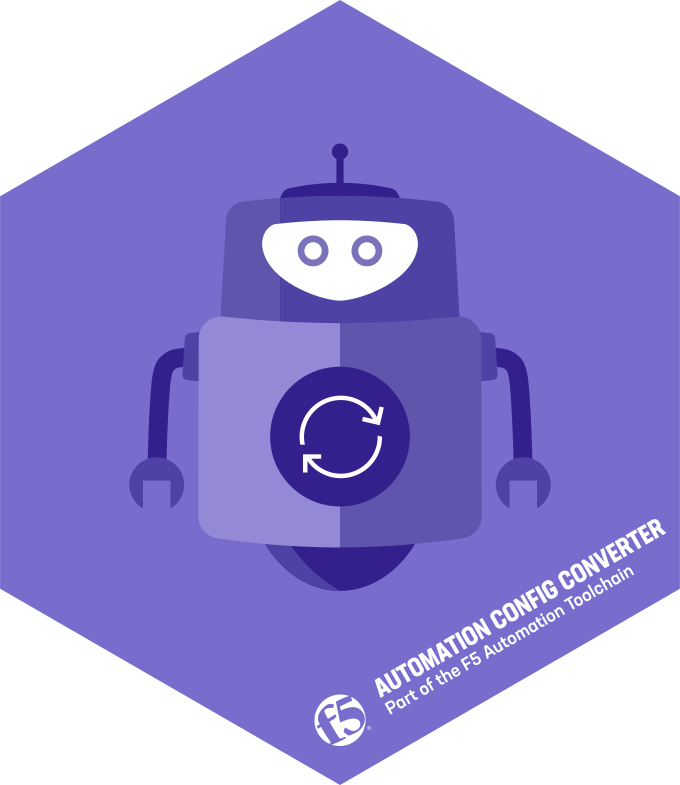

<div align="center">

# F5 BIG-IP Automation Config Converter (BIG-IP ACC)

<a href="https://clouddocs.f5.com/products/extensions/f5-automation-config-converter/latest/">
    
</a>

[Documentation](https://clouddocs.f5.com/products/extensions/f5-automation-config-converter/latest/userguide/getting_started.html) |
[Installation](https://clouddocs.f5.com/products/extensions/f5-automation-config-converter/latest/userguide/install.html) |
[Usage](https://clouddocs.f5.com/products/extensions/f5-automation-config-converter/latest/userguide/using_acc.html) |
[Classes](https://clouddocs.f5.com/products/extensions/f5-automation-config-converter/latest/userguide/classes.html) |
[FAQ](https://clouddocs.f5.com/products/extensions/f5-automation-config-converter/latest/userguide/faq.html) |
[Contributing](https://github.com/f5devcentral/f5-automation-config-converter/blob/main/SUPPORT.md)

[](https://hub.docker.com/r/f5devcentral/f5-automation-config-converter)
[](https://hub.docker.com/r/f5devcentral/f5-automation-config-converter)
[](https://hub.docker.com/r/f5devcentral/f5-automation-config-converter)
[](https://github.com/f5devcentral/f5-automation-config-converter/issues)
[](https://github.com/f5devcentral/f5-automation-config-converter/blob/main/LICENSE)

</div>

## Introduction

F5 BIG-IP Automation Config Converter (BIG-IP ACC) is an app written in Node.js that converts a BIG-IP configuration into an AS3 declaration, distributed as an easy-to-use docker image.


## Quick Start

```docker
docker pull f5devcentral/f5-automation-config-converter:latest
docker run --rm -v "$PWD":/app/data f5-automation-config-converter:latest --ucs /app/data/<your-UCS-file>.ucs
```


## Support

ACC is a community-supported offering, your feedback is greatly appreciated. If you come across a bug please [submit an issue](https://github.com/f5devcentral/f5-automation-config-converter/issues) to our team.
