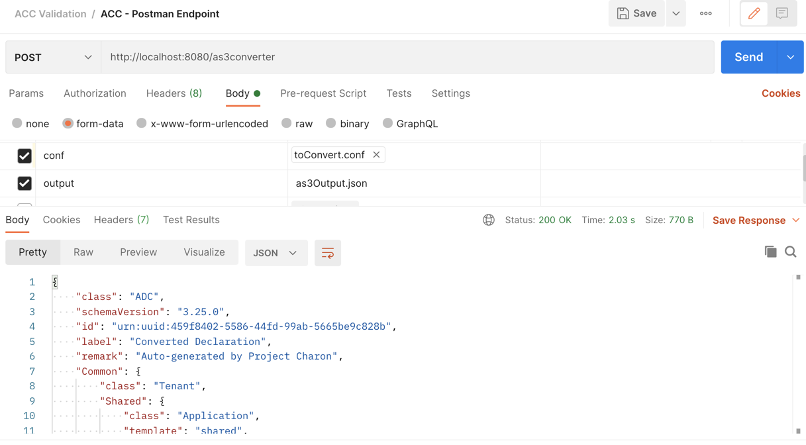

.. _using:

ACC and Docker must be installed prior to the first use.  See :ref:`Installing ACC<install>` for instructions.

Running a Conversion
====================

Run the converter by using one of the following commands, replacing the ACC version where necessary:

| 1. Linux-based systems and Mac, using the following syntax: ``docker run --rm -v  "$PWD":/app/data f5-automation-config-converter:x.x.x -o data/<output-file-name>.json -u data/<input-ucs-file-name>.ucs``
| For example: ``docker run --rm -v  "$PWD":/app/data f5-automation-config-converter:x.x.x -o data/output.json -u data/myucs.ucs``
| Windows, use the following syntax: ``docker run --rm -v %cd%:/app/data f5-automation-config-converter:x.x.x -o data/<output-file-name>.json -u data/<input-ucs-file-name>.ucs``
| For example: ``docker run --rm -v  %cd%:/app/data f5-automation-config-converter:x.x.x -o data/output.json -u data/myucs.ucs``

.. NOTE:: The source UCS/SCF file must be located in the CURRENT directory to run the command line from the example. The *data/myucs.ucs* entry refers to a directory inside the container.

| 2. Run ACC as a REST-API service. Service runs on port 8080 inside the container, or you can map it to any port on your local OS.
| For example: ``docker run --rm -v "$PWD":/app/data -p 8080:8080 f5-automation-config-converter:1.0.0  serve``
| Call it with: ``curl localhost:8080/converter -X POST  --form "ucs=@<input-ucs-file-name>.ucs" --form "output=<output-file-name>.json" --form "verbose=true" |jq .``

Using Postman to POST to ACC Endpoint
-------------------------------------

.. image:: ACC-POST1.png
   :width: 350

Input is bigip confguration called **toConvert.conf**.  Output is file **as3Output.json**.

After post:

``curl localhost:8080/converter -X POST --form "ucs=@<input-ucs-file-name>.ucs" --form "output=<output-file-name>.json" --form "verbose=true" |jq .``

| **Notes:**
| Any client similar to Postman can also be used.
| Max file size to be processed is 1GB.

Docker Command Line Options
---------------------------

* **docker run** portion of the command starts the container.
* **--rm** option removes the container after it exits from running the application.  Without this the container will persist after it exits and you may have to run a command such as `docker container prune` to remove leftover containers.
* The application is located in the **/app** directory of the container.
* **-v** option maps the current directory to the **/app/data** directory in the container.  This is used to read input and write output with the container.  In this example we assume the input UCS file and the output JSON file will be read from and written to the current directory.
* **-p** option maps the tcp port inside container to the local OS port.

ACC command Line Options
------------------------

* **-a** option --application-target <application_target> puts the virtual server to specific application . Works only if the **-v** option is specified. The original VS application is used if this option not specified.
* **-c** option --conf <path> specifies path to input conf/SCF file.
* **-d** option --debug logs generated declaration to console.
* **-e** option --extended shows default values in converted stanzas.
* **-o** option --output <path> specifies the output file name.  You must specify this as being in the **data** directory (with the Docker **-v** option).  When the output file is written in the container it is written to the **/app/data** directory of the container which maps back to the current directory outside of the container where output.json will actually be written.
* **-t** option --tenant-target <tenant_target> puts the virtual server to specific tenant. Works only if **-v**  option specified. The original VS tenant is used if this option not specified.
* **-u** option --ucs <path> specifies a UCS file for the application to read.  For either .conf or SCF files, use the **-c** flag. This must be specified as being in the *data* directory (as specified with the **-v** option).  When the input file is read by the application, it is read from the **/app/data** directory of the container which maps back to the current directory outside of the container where input file is actually read.  This flag is required and you must use only one option of **-u** or **-c**, depending on your input file.
* **-v** option -vs-name <tenant/application/vs_name> filters output by the virtual server name.
* **--as3-converted** logs ACC/AS3-converted tmsh objects to console.
* **--as3-not-converted** option logs to **stdout** a list of configuration objects that ACC did not convert.
* **--as3-recognized** option logs to **stdout** a list of configuration objects that are recognized by AS3.
* **--controls** option adds debugging "Controls" stanza to declaration.
* **--declarative-onboarding** enables DO conversion instead of AS3.
* **--disable-analytics** option will disable usage reporting. Only conversion metadata is collected and reports are correlated using a pseudonymized uuid. Analytics are enabled by default. All data is collected in accordance with the `F5 Privacy Policy <https://www.f5.com/company/policies/privacy-notice>`_.
* **--log <file>** outputs log to the specified file.
* **--safe-mode** option allows a user to bypass post-conversion processing, yielding a less-refined declaration. Accepts a boolean parameter, and defaults to **false**.
* **--summary** option logs to **stdout** counts of each generated class.
* REST-API usage related options when the container is started with **serve** option.  **--verbose** prints more details in the REST-API response.

.. NOTE:: The 3 options of **-v**, **-a** and **-t** typically work together with **-a** and **-t** having the ability to work independently. If **-v** is used, then all other virtual servers are ignored. If **-t** is used, then the virtual server will be placed into this tenant name, even if it was originally in /Common/. If **-a** is used, then the original virtual server will be placed under the application name specified. By default the virtual server name will be used as the application.

Examples
^^^^^^^^

.. code-block:: shell

    Original VS    /Common/VS1
        1) only -a /Common/VS1 provided:
	    "Common": {
	        "class": "tenant",
	        "VS1": {
	                "class": "application"
	                 "VS1": {
	                .........................
	                 {
	    2) -t My_tenant  in addition to -v
	    "My_tenant": {
	        "class": "tenant",
	        "VS1": {
	                "class": "application"
	                 "VS1": {
	                .........................
	                {
	    3) -a "My_application"
	    "My_tenant": {
	        "class": "tenant",
	        "My_aplication": {
	                "class": "application"
	                 "VS1": {
	                .........................
	                {

Testing the Results
^^^^^^^^^^^^^^^^^^^

The best way to test the results is to take the output file and POST the AS3 declaration to a BIG-IP. If the declaration fails, look closely at the error messages, which should provide information on the part of the declaration  needing attention.

| If you attempt to run ACC, and it provides an unexpected error message, it is likely an issue with the parser and the development team wants to hear about it.
| 1. Navigate to `ACC GitHub <https://github.com/f5devcentral/f5-automation-config-converter/issues>`_.
| 2. Click **New issue** > choose the Issue type of Bug report, click **Get started**.
| 3. Give the submission a title then fill out the template, attaching files if applicable.
| 4. When finished, click **Submit new issue**.

Example
^^^^^^^

In this section we show a simple BIG-IP configuration from a UCS file, the command to convert, the response from the container, and finally the resulting AS3 declaration output.

The following is the relevant portion of our example UCS file.

TMSH-VERSION: 13.1.0

.. code-block:: shell

    ltm pool /Common/testACCPool {
        monitor /Common/testACCMonitor
    }
    ltm virtual /Common/testACCVip {
        destination /Common/192.168.2.14:80
        ip-protocol tcp
        mask 255.255.255.255
        pool /Common/testACCPool
        profiles {
            /Common/tcp { }
            /Common/testACCHTTP { }
        }
        source 0.0.0.0/0
        translate-address enabled
        translate-port enabled
    }
    ltm virtual-address /Common/192.168.2.14 {
        address 192.168.2.14
        arp enabled
        mask 255.255.255.255
        traffic-group /Common/traffic-group-1
    }

    ltm monitor http /Common/testACCMonitor {
        adaptive disabled
        defaults-from /Common/http
        destination *:*
        interval 30
        ip-dscp 0
        recv none
        recv-disable none
        send "GET /\r\n"
        time-until-up 0
        timeout 91
    }
    ltm profile http /Common/testACCHTTP {
        app-service none
        defaults-from /Common/http
        proxy-type reverse
        redirect-rewrite matching
    }

This UCS file is put in the same directory from which we are running the container.
In the following example, the container is run using a Windows machine:

.. code-block:: shell

    C:\Users\jordan\Desktop\ACC\dist>docker run --rm -v %cd%:/app/data f5-automation-config-converter:1.0.0 -o data/output.json -u data/acc.ucs --summary
    1118 configuration objects detected
    31 objects are recognized by AS3
    12 objects are supported by ACC
    Generated Declaration { Pool: 1,
    Monitor: 1,
    HTTP_Profile: 1 }

Once it has run through the converter, the resulting AS3 declaration looks like this:

.. code-block:: json
    {
        "class": "ADC",
        "schemaVersion": "3.8.0",
        "id": "urn:uuid:8c029a82-2db6-49ba-8108-959894612b32",
        "label": "Converted Declaration",
        "remark": "Auto-generated by Project ACC",
        "Common": {
            "class": "Tenant",
            "Shared": {
                "class": "Application",
                "template": "shared",
                "testACCPool": {
                    "monitors": [
                        {
                            "use": "/Common/Shared/testACCMonitor"
                        }
                    ],
                    "class": "Pool"
                },
                "testACCVip": {
                    "layer4": "tcp",
                    "pool": "testACCPool",
                    "source": "0.0.0.0/0",
                    "translateServerAddress": true,
                    "translateServerPort": true,
                    "class": "Service_Generic",
                    "profileHTTP": {
                        "use": "/Common/Shared/testACCHTTP"
                    },
                    "virtualAddresses": [
                        "192.168.2.14"
                ],
                    "virtualPort": 80
                },
                "testACCMonitor": {
                    "adaptive": false,
                    "interval": 30,
                    "dscp": 0,
                    "receive": "none",
                    "send": "GET /\\r\\n",
                    "timeUntilUp": 0,
                    "timeout": 91,
                    "class": "Monitor",
                    "monitorType": "http"
                },
                "testACCHTTP": {
                    "proxyType": "reverse",
                    "rewriteRedirects": "matching",
                    "class": "HTTP_Profile"
                }
            }
        }
    }

Example by Application
^^^^^^^^^^^^^^^^^^^^^^

In this section, we show a simple BIG-IP configuration from a UCS file, the command to convert extracting a **single virtual server**, the response from the container and the resulting AS3 declaration output.

The following is the relevant portion of our example UCS file, the virtual we extract is named **f5-big-ip** and we place it into a tenant named **Ten** and an application **Appl**.
If the tenant is not specified, ACC uses the original tenant name; if the application is not specified, the AS3 application uses the virtual name.

TMSH-VERSION: 13.1.0

.. code-block:: shell

    ltm pool /Common/testACCPool {
        monitor /Common/testACCMonitor
    }
    ltm virtual /Common/testACCVip {
        destination /Common/192.168.2.14:80
        ip-protocol tcp
        mask 255.255.255.255
        pool /Common/testACCPool
        profiles {
            /Common/tcp { }
            /Common/testACCHTTP { }
        }
        source 0.0.0.0/0
        translate-address enabled
        translate-port enabled
    }
    ltm virtual-address /Common/192.168.2.14 {
        address 192.168.2.14
        arp enabled
        mask 255.255.255.255
        traffic-group /Common/traffic-group-1
    }

    ltm monitor http /Common/testACCMonitor {
        adaptive disabled
        defaults-from /Common/http
        destination *:*
        interval 30
        ip-dscp 0
        recv none
        recv-disable none
        send "GET /\r\n"
        time-until-up 0
        timeout 91
    }
    ltm profile http /Common/testACCHTTP {
        app-service none
        defaults-from /Common/http
        proxy-type reverse
        redirect-rewrite matching
    }
    ltm virtual /Custom/testACCVip {
        destination /Common/192.168.2.14:80
        ip-protocol tcp
        mask 255.255.255.255
        pool /Common/testACCPool
        profiles {
            /Common/tcp { }
            /Common/testACCHTTP { }
        }
        source 0.0.0.0/0
        translate-address enabled
        translate-port enabled
    }
    ltm virtual-address /Custom/192.168.2.14 {
        address 192.168.2.14
        arp enabled
        mask 255.255.255.255
        traffic-group /Common/traffic-group-1
    }

    ltm monitor http /Custom/testACCMonitor {
        adaptive disabled
        defaults-from /Common/http
        destination *:*
        interval 30
        ip-dscp 0
        recv none
        recv-disable none
        send "GET /\r\n"
        time-until-up 0
        timeout 91
    }
    ltm profile http /Common/testACCHTTP {
        app-service none
        defaults-from /Common/http
        proxy-type reverse
        redirect-rewrite matching
    }

This UCS file is put in the same directory from which we are running the container, which in the following example, is running on a Windows machine:

.. NOTE:: For more information on command line usage, see the *ACC command line options:* section above.

| C:\Users\jordan\Desktop\ACC\dist>docker run --rm -v %cd%:/app/data f5-automation-config-converter:1.2.0 -o data/output.json -u data/acc.ucs  -v /Custom/testACCVip -a Appl -t Ten --summary
| 8 BIG-IP objects detected total
| 6 BIG-IP objects recognized by AS3
| 8 BIG-IP objects supported by ACC
| 3 AS3 stanzas generated
| { Monitor: 1, Pool: 1, Service_HTTP: 1 }
|
Once it has run through the converter, the resulting AS3 declaration looks like this:

.. code-block:: json

    {
        "class": "ADC",
        "schemaVersion": "3.11.0",
        "id": "urn:uuid:6ebb5310-dcc6-42ba-83ab-3f9524827bae",
        "label": "Converted Declaration",
        "remark": "Auto-generated by Project ACC",
        "Ten": {
            "class": "Tenant",
            "Appl": {
                "class": "Application",
                "template": "http",
                "serviceMain": {
                    "layer4": "tcp",
                    "pool": "testACCPool",
                    "translateServerAddress": true,
                    "translateServerPort": true,
                    "class": "Service_HTTP",
                    "profileTCP": {
                        "bigip": "/Common/tcp"
                    },
                    "profileHTTP": {
                        "use": "/Common/Shared/testACCHTTP"
                    },
                    "virtualAddresses": [
                        "192.168.2.14"
                    ],
                    "virtualPort": 80,
                    "snat": "none",
                    "remark": "testACCVip"
                },
                "testACCPool": {
                    "monitors": [
                        {
                            "use": "/Ten/Appl/testACCMonitor"
                        }
                    ],
                    "class": "Pool"
                },
                "testACCMonitor": {
                    "adaptive": false,
                    "interval": 30,
                    "dscp": 0,
                    "receive": "none",
                    "send": "GET /\\r\\n",
                    "timeUntilUp": 0,
                    "timeout": 91,
                    "class": "Monitor",
                    "monitorType": "http",
                    "targetAddress": "",
                    "targetPort": 0
                }
            }
        }
    }

.. IMPORTANT:: 1. Once a conversion has been completed, all files containing sensitive information such as *certificates*, *keys*, and *passwords*, to name a few, should be deleted or moved to a more secure location. Leaving files of these types unsecured can result in exposure and malicious use of the sensitive data.
    2. Best practice is to not publicly expose the *server* mode endpoints as sensitive data from previous conversions may still be present in container memory potentially leaving the system vulnerable.
